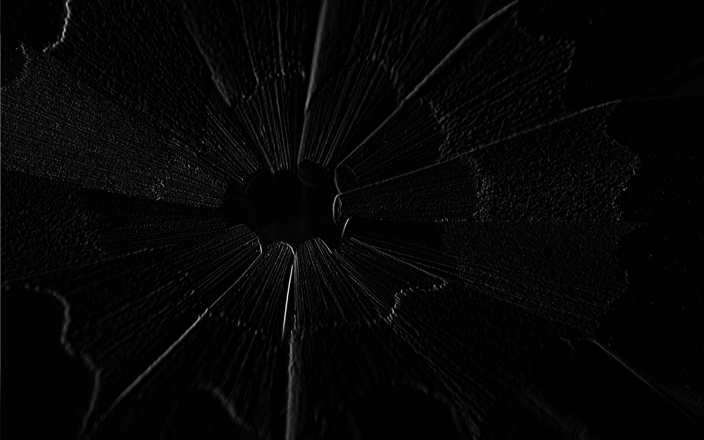
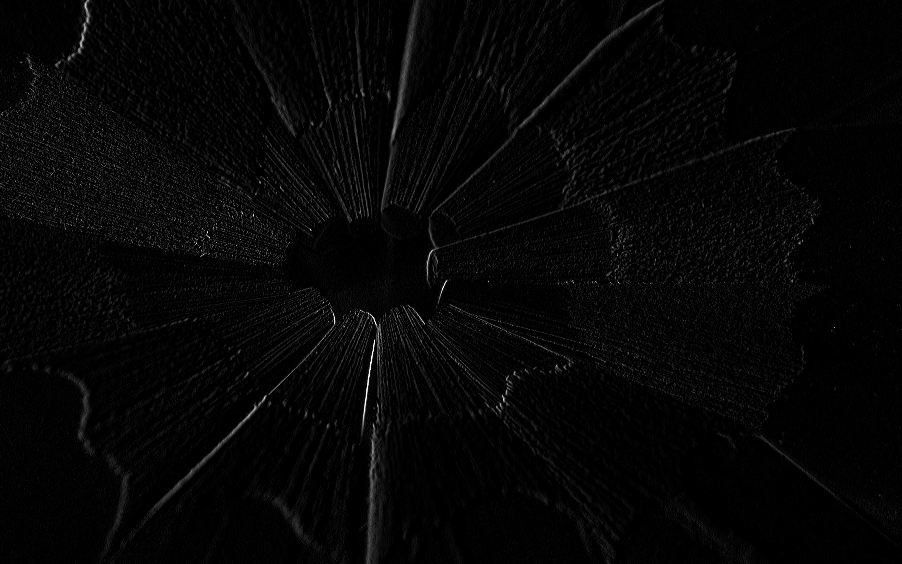
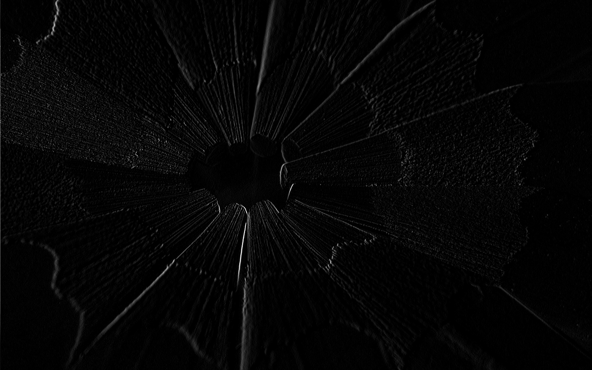
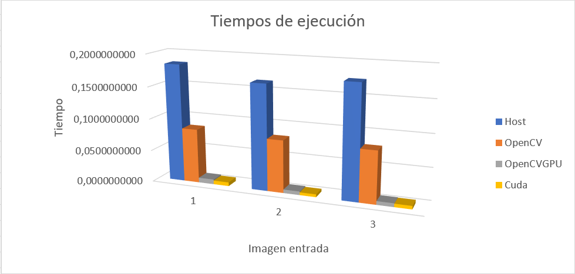
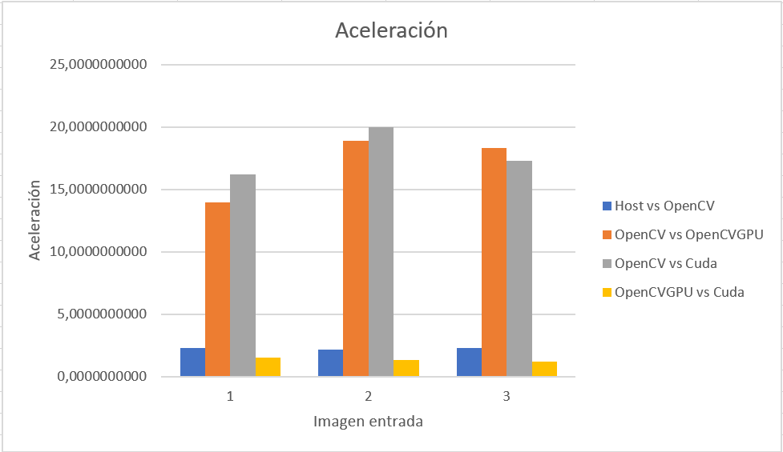

# Informe

## I.  Introducción

El operador Sobel es una máscara que calcula el gradiente de la intensidad de cada punto en una imagen; esto da como resultado qué tan abrupto es el cambio en la imagen en cada punto identificando posibles bordes en la misma. Por esto, este operador es comúnmente usado en el procesamiento de imágenes para la detección de bordes. 

En el presente informe se busca presentar la implementación del operador Sobel en C utilizando diferentes librerias, al igual que una implementación propia en C. Las librerias que se utilizarán son: OpenCV, el módulo de GPU de OpenCV y Cuda para una paralelización de la implementación propia utilizando GPU.

## II.  Desarrollo del tema

Aunque este operador se pueda aplicar en cualquier dirección de la imagen, para este proyecto se implementó unicamente la máscara vertical (ver [Figura 1][fig1]), por lo tanto se destacarán unicamente los bordes verticales.

| | | |
|:---:|:---:|:---:|
|-1   |0    |1    |
|-2   |0    |2    |
|-1   |0    |1    |  
#### *Figura 1: Máscara vertical del operador Sobel*

Se realizaron varias implementaciones de este operador: implementación propia, usando la función disponible con OpenCV, usando la misma función pero en el módulo de GPU de la misma librería y utilizando Cuda para una implementación paralela en GPU.
Para todas las implementaciones se realizan los siguientes pasos:

1. Se cargan los datos de la imagen de entrada.
2. Se convierte la imagen a escala de grises.
3. Se aplica la máscara del operador a los datos de la imagen.
4. Se normalizan los resultados obtenidos de la convolución.

Cada una de estas implementaciones del operador fueron aplicadas a una misma imagen de entrada y se tomó el tiempo que se demoro cada una en procesar la imagen.

  
#### *Imagen 1: Imagen de entrada*

### Implementación propia

```c
void h_sobelFilter(unsigned char* imageIn, unsigned char* imageOut, int width, int height, int maskWidth, char* M) {
	for(int i=0; i<height; i++) {
		for(int j=0; j<width; j++) {
			int ni = i - (maskWidth/2);		//-1
			int nj = j - (maskWidth/2);		//-1
			int res = 0;
			for(int k=0; k < maskWidth; k++) {
				for(int w=0; w < maskWidth; w++) {
					if((ni + k >= 0 && ni + k < height) && (nj + w >= 0 && nj + w < width)) {
						res += imageIn[(ni + k)*width + (nj + w)] * M[k*maskWidth + w];
					}
				}
			}
			if(res < 0)
				res = 0;
			else
				if(res > 255)
					res = 255;
			imageOut[i*width+j] = (unsigned char)res;
		}
	}
}
...
int main() {
	...
	image_sobel = (unsigned char *) malloc (sizeImageGrey);
	cvtColor(image, image_gray_host, CV_BGR2GRAY);
	cv_gray_image = image_gray_host.data;
	h_sobelFilter(cv_gray_image, image_sobel, width, height, 3, h_M);
	...
}
```
La función que aplica el operador recibe como parametros los datos de la imagen de entrada en escala de grises, puntero a donde va a escribir los datos de la imagen resultante, el ancho y alto de la imagen, el ancho de la máscara que se va a aplicar y los datos de la máscara a aplicar.
En este caso se utiliza la función disponible con OpenCV para convertir de RGB a escala de grises.
La normalización de los resultados de la convolución es una sentencia if que asegura que el valor resultante esté entre 0 y 255, de lo contrario se le asigna el valor mínimo o máximo posible. Esto debido a que se está suponiendo y trabajando con imagenes con 8 bits de profundidad de color.

  
#### *Imagen 2: Imagen de salida de implementación propia*

### Implementación usando OpenCV

```c
...
cvtColor(image, image_gray_opencv, CV_BGR2GRAY);
Sobel(image_gray_opencv, image_out_opencv, CV_8UC1, 1, 0, 3);
convertScaleAbs(image_out_opencv, abs_image_out_opencv);
...
```
Para esta implementación se utilizan unicamente funciones y objetos disponibles en la libreria. La función cvtColor es la que se encarga de convertir la imagen a escala de grises; Sobel es la función encargada de aplicar el respectivo operador, como parametros recibe: la imagen en escala de grises, la clase donde guardar la imagen de salida, el formato de la imagen (para este caso 8 bits de profuncidad de color y un solo canal), el grado del gradiente en 'x', el grado del gradiente en 'y' y el tamaño de la máscara; por último se llama a la función para normalizar los valor a 8 bits de profundidad.

  
#### *Imagen 3: Imagen de salida de implementación con OpenCV*

### Implementación usando OpenCV GPU

```c
...
gpu::setDevice(0);
src.upload(image);
gpu::cvtColor(src, gray, CV_BGR2GRAY);
gpu::Sobel(gray, dst, CV_8UC1, 1, 0, 3);
dst.download(image_out_opencv_gpu);
...
```
Para esta implementación se debe indicar que dispositivo se va a utilizar, para esto se llama a la función setDevice() que recibe el *index* del dispositivo. Luego se suben los datos de la imagen de entrada a la gpu y se aplican las mismas funciones que en la implementación con OpenCV disponibles en el módulo de GPU. Por último, se descargan los datos de la gpu al host.

  
#### *Imagen 4: Imagen de salida de implementación con OpenCV GPU*

### Implementación usando Cuda

```c
__global__ void d_sobelFilter(unsigned char* imageIn, unsigned char* imageOut, int width, int height, int maskWidth, char* M) {
	int Row = blockDim.y * blockIdx.y + threadIdx.y;
	int Col = blockDim.x * blockIdx.x + threadIdx.x;

	int nrow = Row - (maskWidth/2);
	int ncol = Col - (maskWidth/2);
	int res = 0;

	if(Row < height && Col < width) {
		for(int i=0; i<maskWidth; i++) {
			for(int j=0; j<maskWidth; j++) {
				if((nrow + i >= 0 && nrow + i < height) && (ncol + j >= 0 && ncol + j < width)) {
					res += imageIn[(nrow + i)*width + (ncol + j)] * M[i*maskWidth + j];
				}
			}
		}
		if(res < 0)
			res = 0;
		else
			if(res > 255)
				res = 255;
		imageOut[Row*width+Col] = (unsigned char)res;
	}
}

__global__ void rgb2gray(unsigned char* d_Pin, unsigned char* d_Pout, int width, int height) {
	int Row = blockIdx.y*blockDim.y + threadIdx.y;
	int Col = blockIdx.x*blockDim.x + threadIdx.x;
	
	if((Row < height) && (Col < width)) {
		d_Pout[Row*width+Col] = d_Pin[(Row*width+Col)*3+BLUE]*0.114 + d_Pin[(Row*width+Col)*3+GREEN]*0.587 + d_Pin[(Row*width+Col)*3+RED]*0.299;

	}
}
...
int main() {
	...
	cudaMemcpy(d_ImageData, h_ImageData, sizeImage, cudaMemcpyHostToDevice);
	cudaMemcpy(d_M, h_M, sizeof(char)*9, cudaMemcpyHostToDevice);
	
	int blockSize = 32;
	dim3 dimBlock(blockSize, blockSize, 1);
	dim3 dimGrid(ceil(width/float(blockSize)), ceil(width/float(blockSize)), 1);
	rgb2gray<<<dimGrid, dimBlock>>>(d_ImageData, d_ImageOut, width, height);
	cudaDeviceSynchronize();
	d_sobelFilter<<<dimGrid, dimBlock>>>(d_ImageOut, d_image_Sobel, width, height, 3, d_M);
	cudaDeviceSynchronize();
		
	cudaMemcpy(h_ImageOut, d_image_Sobel, sizeImageGrey, cudaMemcpyDeviceToHost);
	...
}
```
Esta implementación es una paralelización en GPU de la primera implemetación presentada, en consecuencia recibe los mismos parametros que su versión secuencial.
Sin embargo, aquí se utiliza una implementación propia para convertir imagenes a escala de grises, también utilizando GPU.

  
#### *Imagen 5: Imagen de salida de implementación con Cuda*

#### Memory Bandwidth y Throughput
Para el cálculo del ancho de banda efectivo, se hizo lo siguiente:

![Figura 2][fig2]
#### *Figura 2: Ecuación de ancho de banda efectivo*

Entonces, para la imagen de entrada se tiene que:
* *sizeImage* = *sizeof(unsigned char)* * width * height * channels = 1 * 2560 * 1600 * 3 = 12288000
* *sizeImageGrey* = *sizeof(unsigned char)* * width * height = 1 * 2560 * 1600 = 4096000
* *sizeM* = *sizeof(char)* * 9 = 1 * 9 = 9
* *t* = tiempo promedio de ejecución de implementación de cuda obtenido = 0.0058559500

Por lo que:
* MB = 2.8 GB/s
* 1.25% del ancho de banda teórico

Para el cálculo del *throughput* se utilizó la siguiente ecuación.

![Figura 3][fig3]
#### *Figura 3: Ecuación de throughput*

* kernel rgb2gray:
  * *nFLOPS* = 5
  * *size* = *sizeImageGrey* = 4096000
  * *t* = tiempo que se demora el kernel en ejecutarse, según la herramienta nvvp = 498,524*10^-6 s
  * se tiene entonces: **41.08 GFLOP/s**
  * 0.79% de su capacidad total
* kernel d_sobelFilter:
  * *nFLOPS* = 18
  * *size* = *sizeImageGrey* = 4096000
  * *t* = tiempo que se demora el kernel en ejecutarse, según la herramienta nvvp = 1,225*10^-3 s
  * se tiene entonces: **60.19 GFLOP/s**
  * 1.16% de su capacidad total

## III.  Resultados
Para obtener resultados de desempeño se ejecuto el programa con 3 imagenes diferentes, 20 veces cada una y se obtuvieron los tiempos de cada ejecución (ver [Figura 4][fig4]).

  
#### *Figura 4: Tiempos de ejecución*

Con estos tiempos se calcularon las aceleraciones que se obtenian de una implementación con respecto a otra (ver [Figura 5][fig5]).

  
#### *Figura 5: Aceleraciones obtenidas*

Como era de esperarse, las implementaciones que se basan en uso de GPU obtuvieron tiempos mucho mejores que aquellas que son secuenciales. Además, el rendimiento obtenido con estas implementaciones siempre es muy similar, aunque la aceleracion obtenida de la implementación propia utilizando CUDA contra la que uiliza el módulo GPU de OpenCV permite asegurar que la primera es un poco más rapida que la segunda.

## IV.  Conclusiones

Se puede evidenciar que el uso de GPU para procesamiento de imágenes es una muy buena práctica ya que la mayoría de los algoritmos usados en este campo son altamente paralelizables y resultan en posibles mejoras de hasta 20X en tiempos de ejecución.

Aunque la implementación con CUDA sea la que mejores tiempos obtiene, se puede seguir mejorando al aplicar los conceptos de uso de Memoria Compartida e incluso el uso de memoria constante, para realizar una paralelización aún más óptima.


[fig1]: #figura-1-máscara-vertical-del-operador-sobel
[fig2]: imgs/ecuacion1.jpg
[fig3]: imgs/ecuacion2.jpg
[fig4]: #figura-4-tiempos-de-ejecución
[fig5]: #figura-5-aceleraciones-obtenidas
