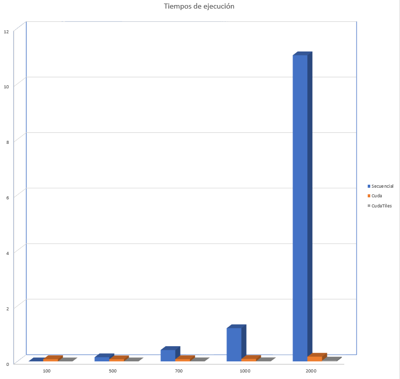

# Informe

## I.  Introducción

En el presente informe se busca presentar la implementación del algoritmo de multiplicación de matrices utilizando CUDA y aprovechando la memoria compartida disponible para cada bloque de hilos. También se muestran algunos resultados obtenidos de pruebas de rendimiento que se realizaron.

## II.  Desarrollo del tema

Hasta ahora se venía trabajando con un kernel de CUDA (ver [Figura 1][fig1]) el cual era ejecutado por una gran cantidad de hilos al mismo tiempo, cada uno calculando un único valor de la matriz resultado. Para esto se debían copiar previamente los datos de las matrices que se iban a multiplicar a la memmoria global del dispositivo, una vez copiados se procedía con el procesamiento de estos datos (lanzamiento del kernel).
```c
__global__ void matrixMultDevice(float* d_A, float* d_B, float* d_C, int width) {
	int Row = blockDim.y * blockIdx.y + threadIdx.y;
	int Col = blockDim.x * blockIdx.x + threadIdx.x;
	if(Row < width && Col < width) {
		float ans = 0.0;
		for(int k=0; k<width; k++) {
			ans += d_A[Row*width+k]*d_B[k*width+Col];
		}
		d_C[Row*width+Col]=ans;
	}
}
``` 
#### *Figura 1: Kernel multiplicación de matrices*

Esta es una buena primera solución a la multiplicación de matrices, sin embargo no es la más deseada ya que presenta algunos inconvenientes. Entre los más destacados, es que al guardar los datos en memoria global, el acceso a los mismos es muy lento y por lo tanto no se logra aprovecar todo el potencial del hardware del dispositivo.

Para solucionar esto se propone el uso de los distintos niveles de memoria con los que cuentan las GPU; más especificamente se busca aprovechar la memoria compartida con la que cuenta cada bloque de hilos. Esta memoria tiene como principal característica que puede ser accedida a una velocidad muy alta y permite un accesso totalmente paralelo, es decir, todos los hilos que tengan acceso a ella lo pueden hacer en cualquier momento de su ejecución sin ningún bloqueo o inconveniente parecido.
Con la memoria compartida hay que tener en cuenta que solamente está disponible para los hilos en un mismo bloque, y cada bloque tiene su propia memoria.
La principal desventaja de esta memoria es que normalmente cuenta con una capacidad de almacenamiento muy baja, por lo que, cuando se vaya a utilizar hay que tener en cuenta que los datos que se vayan a cargar quepan en dicha memmoria.

La estrategia que se toma para sobrellevar esta desventaja es particionar los datos en subconjuntos, llamados *tiles*. Estos *tiles* podrán ser cargados en memoria compartida y procesados en el kernel independientes unos de otros. Este proceso de cargar y procesar los datos lo van a realizar todos los hilos del bloque paralelamente, tal como funcionaba en la versión del kernel anterior.
Como la carga de datos se está haciendo en paralelo por los hilos y, no es seguro que estos acaben al mismo tiempo, estos se deben sincronizar para asegurar que todos hayan terminado de cargar los datos que les correspondían antes de continuar. Esto garantiza un cálculo con los datos correctos, y no con datos basura que pueda haber al no cargar en su totalidad los datos a memoria compartida.  
La misma sincronización se debe realizar una vez los hilos terminen de calcular el elemento resultado que les correspondían. Esto es necesario ya que una vez finalizado este proceso, se procede a procesar el siguiente *tile*, lo que implica diferentes datos que deben ser cargados a memoria.

Así como en la versión del kernel anterior se debía tener en cuenta solo los hilos que estaban dentro del rango de datos; en esta nueva versión se debe garantizar la misma situación para los hilos en el rango del *tile* y rango de datos correcto. Esto se logra con una comparación similar a la hecha anteriormente. En este caso, si el hilo que se está ejecutando falla esta condición, debe cargar un 0 en el espacio de memoria compartida que le corresponde, esto es necesario ya que de lo contrario es muy posible que se este dejando contenido basura en dicho espacio que puede alterar el resultado del cálculo.

El código del kernel para la multiplicación de matrices utilizando memoria compartida, y teniendo en cuenta lo dicho, queda de la siguiente manera (ver [Figura 2][fig2]):

```c
__global__ void matrixMultTiled(float* d_A, float* d_B, float* d_C, int width) {
	__shared__ float ds_A[TILE_WIDTH][TILE_WIDTH];
	__shared__ float ds_B[TILE_WIDTH][TILE_WIDTH];
	
	int bx = blockIdx.x;
	int by = blockIdx.y;
	int tx = threadIdx.x;
	int ty = threadIdx.y;

	// Identificar la fila y la columna del elemento de d_C que se va a trabajar
	int Row = by * TILE_WIDTH + ty;
	int Col = bx * TILE_WIDTH + tx; 
	
	float ans = 0;	
	// Iterar sobre los tiles de d_A y d_B necesarios para calcular el elemento de d_C
	for(int m=0; m < (TILE_WIDTH + width - 1)/TILE_WIDTH; m++) {
		// Carga cooperativa de los tiles de d_A y d_B a memoria compartida
		if(m*TILE_WIDTH + tx < width && Row < width)
			ds_A[ty][tx] = d_A[Row*width + m*TILE_WIDTH + tx];
		else
			ds_A[ty][tx] = 0.0;
		if(m*TILE_WIDTH + ty < width && Col < width)
			ds_B[ty][tx] = d_B[(m*TILE_WIDTH + ty) * width + Col];
		else
			ds_B[ty][tx] = 0.0;

		__syncthreads();
	
		for(int k=0; k<TILE_WIDTH; k++) {
			ans += ds_A[ty][k] * ds_B[k][tx];
		}
		__syncthreads();
	}
	if(Row < width && Col < width)
		d_C[Row*width+Col]=ans;
}
``` 
#### *Figura 2: Kernel multiplicación de matrices con memoria compartida*


## III.  Resultados

Para probar los kernel aquí presentados, se realizó lo siguiente:
* Se tomaron 5 tamaños de matrices diferentes: 100, 500, 700, 1000 y 2000.
* Para cada uno de estos tamaños se ejecutó el programa 20 veces.
* En cada ejecución del programa se hacía el calculo de la multiplicación de las matrices generadas aleatoriamente con el algoritmo secuencial, el kernel para multiplicación de matrices y el kernel para multiplicación de matrices utilizando memoria compartida.
* Por cada algoritmo se tomaron los tiempos de ejecución y se verificaban resultados comparando las soluciones de las versiones paralelas con la solución de la versión secuencial.
* Por último se calcula la aceleración obtenida con el kernel con memoria compartida contra la versión secuencial.

Estos fueron los resultados:

### **Gráfica de Tiempos:**
  
*Grafica 1: tamaño de matriz contra tiempo de ejecución*

### **Gráfica de Aceleración:**
  
*Grafica 2: tamaño de matriz contra aceleración obtenida*

Como se puede ver para matrices pequeñas la mejora en el tiempo de ejecución no es mucha, sin embargo para matrices grandes la mejora en los tiempos de ejecución es muy significativa entre la versión secuencial y la paralela con memoria compartida obteniendo una aceleración de hasta 380X. Incluso, de acuerdo a la [Gráfica 1][graf1], mediante el uso de memoria compartida se puede lograr una reducción en los tiempos de ejcución de un poco más de la mitad con respecto a la versión sin memoria compartida, esto quiere decir una mejora de entre 2X y 3X en rendimiento.

## IV.  Conclusiones

Aunque la memoria compartida sea de poca capacidad de almacenamiento no significa que no se pueda utilizar para procesar grandes cantidades de datos. Para esto se hace uso de del método de *Tiling*, el cual permite aprovechar las capacidades de estas memorias.

El uso de memoria compartida para acceder a los datos que se van a procesar, aunque es un poco más complejo de implementar y se deben tener ciertas consideraciones de cuidado, representa una mejora significativa en cuanto a rendimiento contra el uso de memoria global.


[fig1]: #figura-1-kernel-multiplicación-de-matrices
[fig2]: #figura-2-kernel-multiplicacion-de-matrices-con-memoria-compartida
[graf1]: #grafica-de-tiempos